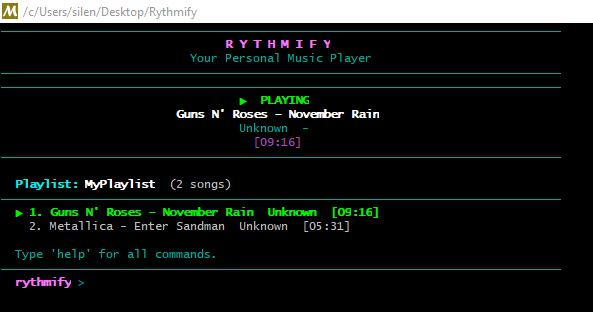
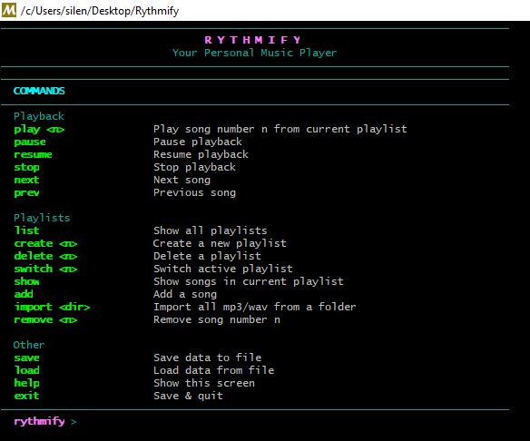

# Rythmify

Rythmify is a CLI based interactive music player made using the C++ language. It currently only supports Windows 10 or higher and uses MySYS2 as a dependency in order to provide the necessary tools to compile the project.



---

## Requirements

- Windows 10 or newer
- MSYS2 - download it from https://www.msys2.org/

---

## Setup

**1. Install MSYS2**

Go to https://www.msys2.org/, download the installer and run it. When it finishes, open **MSYS2 UCRT64** from the Start Menu and run this to install the compiler:

```
pacman -S mingw-w64-ucrt-x86_64-gcc
```

Press Enter when it asks you to confirm.

**2. Get the project**

Download the ZIP from this page (green Code button → Download ZIP) and extract it somewhere, for example your Desktop.

**3. Build**

Open **MSYS2 UCRT64** from the Start Menu (not PowerShell, not cmd - it won't work there) and run:

```
cd /c/Users/YourUsername/Desktop/Rythmify
g++ -std=c++17 main.cpp MusicPlayer.cpp Playlist.cpp Song.cpp -o Rythmify.exe -lwinmm
```

If nothing red appears, it worked.

**4. Run**

```
./Rythmify.exe
```
---

## Playing your first song

Once you're inside Rythmify, here's how to get a song playing:

**Step 1 - Create a playlist**
```
create MyPlaylist
```

**Step 2 - Switch to it**
```
switch MyPlaylist
```

**Step 3 - Import your music folder**
```
import C:\Users\YourUsername\Music
```
This will scan the folder and add every mp3 and wav file it finds. You can also point it to Downloads or any other folder.

**Step 4 - Play**
```
play 1
```

That's it. The song starts playing immediately.

---

## Commands



```
play <n>        play song number n
pause           pause
resume          resume
stop            stop
next            next song
prev            previous song
create <name>   create a new playlist
switch <name>   switch to a playlist
list            show all playlists
show            show songs in current playlist
add             add a song manually
remove <n>      remove song number n
import <path>   import all mp3/wav files from a folder
save            save
load            load from file
help            show all commands
exit            save and quit
```

---

## Notes

- Has to be opened through MSYS2 UCRT64, not cmd or PowerShell.
- No external libraries needed, uses the built-in Windows audio API.
- Reads song title, artist and album automatically from the mp3 metadata. If those are missing it falls back to the filename.

---

## License

[MIT License](LICENSE)
